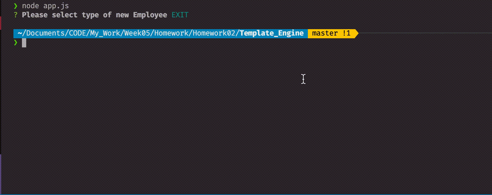

# Template_Engine

Command line tool allows administrator to create and display users such as employees, managers, engineers, and interns.

## Instructions

in the command line use node to run app.js to get user information and save them to output files. These files are then read by the front end webpage to display user information.

